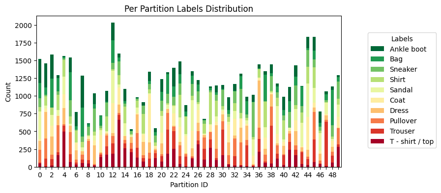
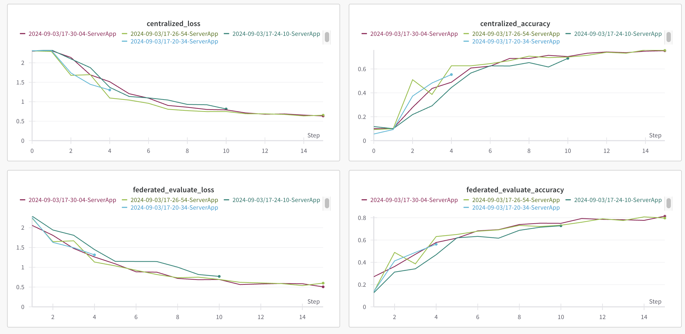

# Federated Learning with PyTorch and Flower (Advanced Example)

> \[!TIP\]
> This example shows intermediate and advanced functionality of Flower. It you are new to Flower, it is recommended to start from the [quickstart-pytorch](https://github.com/adap/flower/tree/main/examples/quickstart-pytorch) example or the [quickstart PyTorch tutorial](https://flower.ai/docs/framework/tutorial-quickstart-pytorch.html).

This example shows how to extend your `ClientApp` and `ServerApp` capabilities compared to what's shown in the [`quickstart-pytorch`](https://github.com/adap/flower/tree/main/examples/quickstart-pytorch) example. In particular, it will show how the `ClientApp`'s state (and object of type [RecordSet](https://flower.ai/docs/framework/ref-api/flwr.common.RecordSet.html)) can be used to enable stateful clients, facilitating the design of personalized federated learning strategies, among others. The `ServerApp` in this example makes use of a custom strategy derived from the built-in [FedAvg](https://flower.ai/docs/framework/ref-api/flwr.server.strategy.FedAvg.html). In addition, it will also showcase how to:

1. Save model checkpoints
2. Save the metrics available at the strategy (e.g. accuracies, losses)
3. Log training artefacts to [Weights & Biases](https://wandb.ai/site)
4. Implement a simple decaying learning rate schedule across rounds

The structure of this directory is as follows:

```shell
advanced-pytorch
├── pytorch_example
│   ├── __init__.py
│   ├── client_app.py   # Defines your ClientApp
│   ├── server_app.py   # Defines your ServerApp
│   ├── strategy.py     # Defines a custom strategy
│   └── task.py         # Defines your model, training and data loading
├── pyproject.toml      # Project metadata like dependencies and configs
└── README.md
```

> \[!NOTE\]
> By default this example will log metrics to Weights & Biases. For this, you need to ensure that your system has logged in. Often it's as simple as executing `wandb login` on the terminal after installing `wandb`. Please, refer to this [quickstart guide](https://docs.wandb.ai/quickstart#2-log-in-to-wb) for more information.

This examples uses [Flower Datasets](https://flower.ai/docs/datasets/) with the [Dirichlet Partitioner](https://flower.ai/docs/datasets/ref-api/flwr_datasets.partitioner.DirichletPartitioner.html#flwr_datasets.partitioner.DirichletPartitioner) to partition the [Fashion-MNIST](https://huggingface.co/datasets/zalando-datasets/fashion_mnist) dataset in a non-IID fashion into 50 partitions.



> \[!TIP\]
> You can use Flower Datasets [built-in visualization tools](https://flower.ai/docs/datasets/tutorial-visualize-label-distribution.html) to easily generate plots like the one above.

### Install dependencies and project

Install the dependencies defined in `pyproject.toml` as well as the `pytorch_example` package.

```bash
pip install -e .
```

## Run the project

You can run your Flower project in both _simulation_ and _deployment_ mode without making changes to the code. If you are starting with Flower, we recommend you using the _simulation_ mode as it requires fewer components to be launched manually. By default, `flwr run` will make use of the Simulation Engine.

When you run the project, the strategy will create a directory structure in the form of `outputs/date/time` and store two `JSON` files: `config.json` containing the `run-config` that the `ServerApp` receives; and `results.json` containing the results (accuracies, losses) that are generated at the strategy.

By default, the metrics: {`centralized_accuracy`, `centralized_loss`, `federated_evaluate_accuracy`, `federated_evaluate_loss`} will be logged to Weights & Biases (they are also stored to the `results.json` previously mentioned). Upon executing `flwr run` you'll see a URL linking to your Weight&Biases dashboard wher you can see the metrics.



### Run with the Simulation Engine

With default parameters, 25% of the total 50 nodes (see `num-supernodes` in `pyproject.toml`) will be sampled for `fit` and 50% for an `evaluate` round. By default `ClientApp` objects will run on CPU.

> \[!TIP\]
> To run your `ClientApps` on GPU or to adjust the degree or parallelism of your simulation, edit the `[tool.flwr.federations.local-simulation]` section in the `pyproject.tom`.

```bash
flwr run .

# To disable W&B
flwr run . --run-config use-wandb=false
```

You can run the app using another federation (see `pyproject.toml`). For example, if you have a GPU available, select the `local-sim-gpu` federation:

```bash
flwr run . local-sim-gpu
```

You can also override some of the settings for your `ClientApp` and `ServerApp` defined in `pyproject.toml`. For example:

```bash
flwr run . --run-config "num-server-rounds=5 fraction-fit=0.5"
```

### Run with the Deployment Engine

> \[!NOTE\]
> An update to this example will show how to run this Flower application with the Deployment Engine and TLS certificates, or with Docker.

### Behind the scenes

So how does this work? How does Flower execute this simulation?

When we call run_simulation, we tell Flower that there are 10 clients (num_supernodes=10, where 1 SuperNode launches 1 ClientApp). Flower then goes ahead an asks the ServerApp to issue an instructions to those nodes using the FedAvg strategy. FedAvg knows that it should select 100% of the available clients (fraction_fit=1.0), so it goes ahead and selects 10 random clients (i.e., 100% of 10).

Flower then asks the selected 10 clients to train the model. Each of the 10 ClientApp instances receives a message, which causes it to call client_fn to create an instance of FlowerClient. It then calls .fit() on each the FlowerClient instances and returns the resulting model parameter updates to the ServerApp. When the ServerApp receives the model parameter updates from the clients, it hands those updates over to the strategy (FedAvg) for aggregation. The strategy aggregates those updates and returns the new global model, which then gets used in the next round of federated learning.

### GPU

It is possible to switch to a runtime that has GPU acceleration enabled (on Google Colab: Runtime > Change runtime type > Hardware acclerator: GPU > Save). Note, however, that Google Colab is not always able to offer GPU acceleration. If you see an error related to GPU availability in one of the following sections, consider switching back to CPU-based execution by setting DEVICE = torch.device("cpu"). If the runtime has GPU acceleration enabled, you should see the output Training on cuda, otherwise it’ll say Training on cpu.

### Server side parameter initialization 

Flower, by default, initializes the global model by asking one random client for the initial parameters. In many cases, we want more control over parameter initialization though. Flower therefore allows you to directly pass the initial parameters to the Strategy. We create an instance of Net() and get the paramaters.

### Server side parameter initialization 

Centralized Evaluation (or server-side evaluation) is conceptually simple: it works the same way that evaluation in centralized machine learning does. If there is a server-side dataset that can be used for evaluation purposes, then that’s great. We can evaluate the newly aggregated model after each round of training without having to send the model to clients. We’re also fortunate in the sense that our entire evaluation dataset is available at all times.

Federated Evaluation (or client-side evaluation) is more complex, but also more powerful: it doesn’t require a centralized dataset and allows us to evaluate models over a larger set of data, which often yields more realistic evaluation results. In fact, many scenarios require us to use Federated Evaluation if we want to get representative evaluation results at all. But this power comes at a cost: once we start to evaluate on the client side, we should be aware that our evaluation dataset can change over consecutive rounds of learning if those clients are not always available. Moreover, the dataset held by each client can also change over consecutive rounds. This can lead to evaluation results that are not stable, so even if we would not change the model, we’d see our evaluation results fluctuate over consecutive rounds.

### Sending/receiving arbitrary values to/from clients

- https://flower.ai/docs/framework/tutorial-series-use-a-federated-learning-strategy-pytorch.html#Sending/receiving-arbitrary-values-to/from-clients

Flower provides a way to send configuration values from the server to the clients using a dictionary. Let’s look at an example where the clients receive values from the server through the config parameter in fit (config is also available in evaluate). 

The fit method receives the configuration dictionary through the config parameter and can then read values from this dictionary. In this example, it reads server_round and local_epochs and uses those values to improve the logging and configure the number of local training epochs


### Strategy Customization


